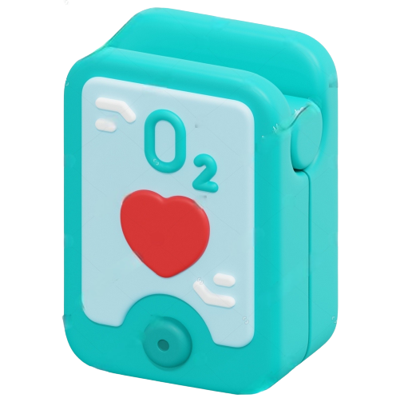

# Glucometer App


<h1 align="center">
  
</h1>

## Description
The Glucometer App is a comprehensive digital companion for health tracking. Record and monitor vital health metrics such as heart rate, cholesterol, uric acid, glucose, and SpO2 levels. With data storage, sharing options, and visual trend analysis via graphs, this app revolutionizes teleconsultation and remote health monitoring. Bridge the gap between patients and healthcare professionals for more informed and personalized remote consultations.

## Installation
To run this app on your local machine, follow these steps:

1. Ensure you have Flutter installed on your system. If not, you can install it from the official Flutter website: [https://flutter.dev/docs/get-started/install](https://flutter.dev/docs/get-started/install)
2. To build: You'll need [Android Studio](https://developer.android.com/studio/), [Xcode](https://developer.apple.com/xcode/), [iOS Simulator](https://docs.expo.io/workflow/ios-simulator/) and [Cocoapods](https://cocoapods.org/). You will need to sign in to your Apple Developer account to run the app on your device.

From your command line:

```bash
# Go into the folder
$ cd max_heart_reader

# Install dependencies
$ flutter clean
$ flutter pub get

# Run the app
$ flutter run
```

> **Note**
> If you're testing on iOS, [see this guide](https://docs.flutter.dev/testing/build-modes). The default mode is `--debug` where the app cannot run in standalone mode.

### Build for iOS: Create Podfile

To begin, create a `Podfile` in the root directory of your iOS project. The `Podfile` specifies the dependencies for your project. Open the terminal and navigate to your project's root directory:

```bash
cd /path/to/YourProjectIOSFolder

# If Podfile does not exist
touch Podfile

pod install

# Open .xcworkspace
open Runner.xcworkspace

# Click on the play button in Xcode to build and run the app.
```

🚀 🚀 🚀
